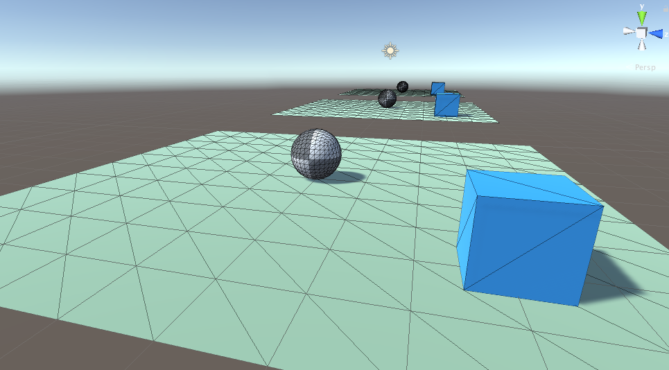
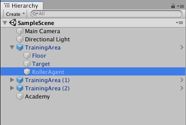
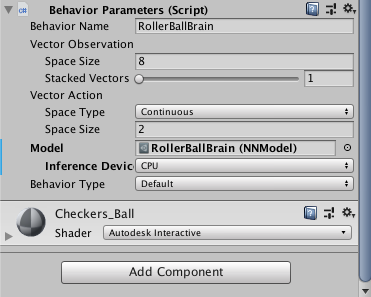
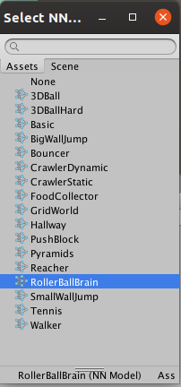

# RollerBall com Unity ML-Agents



Este tutorial explora a demo RollerBall da Unity e foi adaptado para executar num ambiente linux.

Para executá-lo você necessitará de:

1. Criar uma conta na Unity;
2. Instalar o [Unity Hub](https://unity3d.com/get-unity/download) para Linux;
3. Instalar python (recomendo [anaconda](https://www.anaconda.com/distribution/) ou [miniconda](https://conda.io/miniconda.html));
4. No Unity hub instalar o Unity 2018.4.14f1 (testado, mas outras versões devem funcionar);
5. Clonar o repositório asantos2000/Unity-AI-RollerBall;
6. Instalar os môdulos python.

Se você é novo no Unity recomendo os [cursos da Unity](https://learn.unity.com/courses).

## Resultado

Após finalizar o tutorial esse será o resultado:

[](https://www.youtube.com/watch?v=9bJ-advG5fQ)

## Preparando seu ambiente

### 1. Criar uma conta na Unity

Acesse <https://id.unity.com/> e selecione criar uma conta ou entre com sua conta Google ou Facebook.

### 2. Instalar o Unity Hub

Acesse <https://unity3d.com/get-unity/download> e selecione *Download Unity Hub*

> Essas instruções podem variar de acordo com sua distro de linux, as seguintes foram testadas no Ubuntu 19.10.

Após baixar o arquivo *UnitHub.AppImage*, salve-o em alguma pasta que você costuma manter seus aplicativos (Ex: ~/Apps).

No terminal, vá para a pasta onde salvou o arquivo, dê permissão de execução e execute-o:

```bash
chmod +x UnitHub.AppImage

./UnitHub.AppImage
```
Na primeira execução você pode aceitar a integração com o SO para criar o ícone.

### 3. Instalar python

Se você já conhece python pode saltar essa etapa, apenas crie um ambiente para instalar o ml-agents.

Para os demais, acesse <https://conda.io/miniconda.html> e escolha a sua plataforma, neste tutorial será *Linux Installers* - Miniconda Linux 64-bit (a maioria dos Linux são 64-bits a não ser que você esteja usando alguma distro baseada no FreeBSD que também suporta 32-bits).

Baixe o arquivo e execute-o:

```bash
bash Miniconda3-latest-Linux-x86_64.sh
```

[Siga as instruções.](https://conda.io/projects/conda/en/latest/user-guide/install/linux.html)

Após instalação sai e entre novamente no terminal crie um ambiente para instalar o ml-agents:

```bash
conda create --name ml-agents python=3.7

conda activate unity-pie-37
```

### 4. Instalar o Unity

Abra o aplicativo Unity Hub (pelo ícone ou clicando no programa) e selecione *Installs*, *Add* e selecione a versão 2018 LTS mais recente. A versão utilizada neste tutorial foi a 2018.4.14f1.

> Se você não estiver utilizando o Linux ou estiver instalando uma versão diferente, procure e selecione o môdulo *Linux Build Support*, ele será necessária para criar o ambiente (env).

A instalação deverá demorar alguns minutos, enquanto isso clone o repositório com o código-fonte.

### 5. Clonar o repositório

No terminal, vá para sua pasta de projetos do Unity e clone o repositório:

```bash
# Se não existir crie uma ou selecione outra pasta
cd ~/Unity/Projects

git clone https://github.com/asantos2000/unity-ml-agents-rollerball.git
```

Isso criará a pasta unity-ml-agents-rollerball.

### 6. Instalando o môdulo ml-agents

Você precisa instalar môdulos python no seu ambiente `ml-agents`, abara um terminal e ative seu ambiente.

```bash
cd unity-ml-agents-rollerball

conda activate ml-agents

pip install mlagents

# Teste
mlagents-learn --help
```

Para mais informações acesse a página de [instalação da Unity no github](https://github.com/Unity-Technologies/ml-agents/blob/master/docs/Installation.md).

## Executando o código

Abra o Unity Hub e selecione *Add* e navegue até encontrar a pasta `unity-ml-agents-rollerball`, entre nela e selecione *Ok*.

Se a versão do Unity for diferente da indicada, um triângulo amarelo indicará o problema na coluna Unity version, selecione na caixa de seleção (pequeno triângulo invertido) a versão que você instalou.

Clique no nome do projeto para abrí-lo.

### Executando um modelo pré-treinado

Nesse ponto estamos prontos para iniciar o treinamento, mas caso você queira reproduzir o resultado do vídeo da introdução, precisamos fazer algumas modificações.

Esses passos são os mesmos para usar qualquer modelo, inclusive o que iremos criar no treinamento.

Para simplificar as intruções, selecione no canto superior direito o *Layout* *Default*, isso fará o editor ter uma aparência conhecida.

No editor do Unity, na árvore do projeto (canto inferior esquerto), selecione a pasta *Scenes* e clique duas vezes para abrir a cena `SampleScene`.



Na *Hierarchy*, parte superior, expanda `SampleScene` e expanda `TrainingArea`, localize o objeto `RollerAgent` e selecione-o.

Do lado esquerdo, no *Inspector*, desça até encontrar o componente *Bahavior Parameters*, clique no círculo ao lado do campo Model e a caixa de seleção será exibida.





Selecione `RollerBallBrain` com dois cliques.

Execute a cena, clicando em *Play* no centro da parte superior do editor.

Se tudo estiver correto, você deverá ver apenas o agente do centro se movendo, os demais ainda não tem miolos :).

No futuro você poderá comprar "cérebros" na loja da Unity treinar seus próprios modelos.

## Treinando cérebros

Agora que tudo está funcionando, vamos treinar um modelo, mas antes, desfaça o que você fez com o agente, remova seu modelo da mesma forma que você adicionou, mas selecione *None* desta vez.

### Criando um executável do seu jogo

Para treinar precisaremos criar uma compilação do jogo, para isso vamos seleciona no menu do editor *Build Settings...*.

Nâo há muito o que fazer, mas o local onde você salvará e o nome são muito importantes, eles serão usados para indicar o ambiente de treinamento. Então verifique se o *Target Platform* é Linux e clique em *Build*.

Salve onde você achar melhor, como sugestão salve na pasta `tf/envs`.

A compilação demora alguns minutos, então vamos preparar o treinamento.

### Executando o treinamento

O treinamento é realizado em python, você pode abrir o jupyter notebook que está na pasta `tf/notebooks` e executá-lo para testar.

Abra um terminal e navegue para a pasta `tf/notebooks` que está no seu projeto.

```bash
conda activate ml-agents

jupyter notebook
```

> Se você estiver utilizando o VS Code com o plugin Python, você pode abrir e executar o notebook nele, mas lembre-se de selecionar o seu ambiente python (ml-agents).

Vamos executar o treinamento com o comando `mlagents-learn`, mas antes vamos verificar o arquivo de configuração. Nele duas variáveis irão determinar a duração do treinamento:

```yaml
default:

    batch_size: 1024
    buffer_size: 10240
```

Caso fique lento, neste cenário você pode reduzí-las para:

```yaml
batch_size: 10
buffer_size: 100
```

Isso não irá impactar muito o resultado, já que o ambiente é simples.

Finalmente vamos exercitar alguns cérebros, no terminal, na pasta `tf`, entre com o comando:

```bash
mlagents-learn config.yaml --env=envs/RollerBall --run-id=RollerBall-1 --train
```

> Se na compilação você salvou o seu jogo em outra pasta, modifique o argumento `env`.

O treinamento irá abrir uma pequena janela do jogo e você poderá ver os agentes em velocidade acelerada perseguindo o cubo.

Isso poderá levar muitos minutos dependendo do seu hardware, em um I7 geração 8, com 16MB de memória e uma GPU RTX 2060, o treinamento demorou cerca de 5min.

Para acomanhar o treinamento, abra outro terminal e navegue para a pasta `tf` e execute o tensorflow-board.

```bash
tensorboard --logdir=summaries --port 6006
```

Ele pode ser acessado na url: <http://localhost:6006/>

### Copiando o seu modelo

Após finalizar o treinamento, na pasta `tf/model` você terá um cérebro novinho com seu recente treinamento, para usá-lo, copie-o para a pasta `Assets/TFModels` e edite seus agentes como você fez na seção "Executando um modelo pré-treinado".

## Conclusão

Se tudo deu certo até aqui, você tem três bolas perseguindo cubos azuis, pode não parecer muito, mas é a base para muita coisa legal, dê uma olhada nos projetos que selecionei na seção "Referências".

Como última dica, se você for usar esse modelo em todos os agente, edite o *Prefab* `TrainingArea`, faça a mesma modificação que você fez para um e ela valerá para todos.

## Referências

* [Unity ML - Agents (Beta)](https://github.com/c-barron/ml-agents)
* [Making a New Learning Environment](https://github.com/Unity-Technologies/ml-agents/blob/master/docs/Learning-Environment-Create-New.md)
* [ML-Agents Community Challenge Winners](https://unity3d.com/machine-learning/)
* [ccthien/MetalWarfareML](https://github.com/ccthien/MetalWarfareML)
* [SpaceY (Unity ML-Agents demo project)](https://github.com/bmv-2143/SpaceY-Rocket-Lander---Unity-ML-Agents-Demo-Project)
* [UnityMLSatelliteAI](https://github.com/Emilus666/UnityMLSateliteAI)
* [hide-escape](https://github.com/HappySlice/hide-escape)